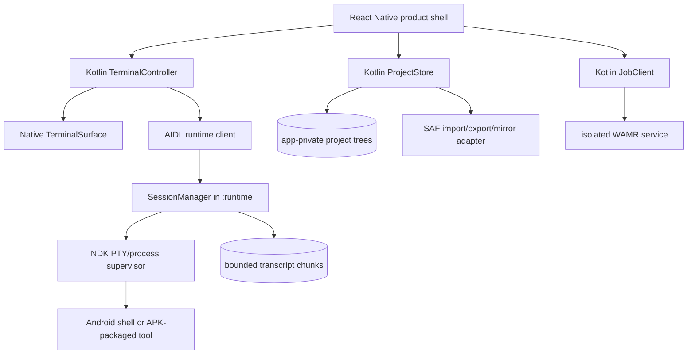

# CodeForge Mobile: Terminal-First Sandbox and Linux Workspace Plan

**Status:** Proposed implementation baseline
**Audience:** Android platform, product design, terminal/runtime, editor, security, QA, and release engineering
**Primary target:** Stock Android, API 26+ subject to device-matrix validation, arm64-v8a first
**Relationship to prior work:** This plan specializes and, where noted, refines the broader Android-first architecture in `professional-ide-research.md`.

## Executive decision

CodeForge should ship as a **terminal-first, offline-capable Android development workspace**, not as “Linux on Android,” a secure container, or a mobile Docker replacement. The first credible product is a custom, production-signed private APK with durable app-private projects, a real PTY-backed Android shell for trusted workspaces, a mobile developer keyboard, an editor/terminal split, typed and observable job execution, and a capability-limited WebAssembly lane. A same-architecture PRoot environment is a later, separately installed **trusted Linux compatibility pack**. QEMU is not part of the core product.

The terminal is an Android UI over a real pseudo-terminal. Its child processes remain ordinary processes under CodeForge’s Android app UID, SELinux domain, seccomp policy, permissions, and lifecycle. A separate `:runtime` process improves crash containment but does not create a security boundary from other CodeForge files. Android’s application sandbox protects CodeForge from other apps; it does not protect CodeForge from native code that CodeForge deliberately executes under its own UID.[1]

> **Private APK does not mean privileged APK.** Sideloading changes distribution, not Android’s UID, SELinux, storage, background-service, or executable-code rules. It also does not waive open-source license obligations.

### Recommended private release scope

The first terminal-capable private release should include:

1. An app-private canonical project store with explicit SAF import, export, and linked-mirror flows.
2. A terminal-first phone/tablet shell with persistent session metadata, bounded transcript, session switching, and honest running/exited/interrupted states.
3. A native Android PTY/process supervisor that starts `/system/bin/sh` and only verified APK-packaged tools using `argv`, never interpolated command strings.
4. A native developer accessory row above the user’s IME, with terminal and editor layouts, visible modifier state, hardware-key support, and guarded paste.
5. A real editor/terminal split that works in portrait, landscape, multi-window, and with the IME visible.
6. Safe execution tiers: inspect-only by default; WAMR/WASI with explicit capabilities for bounded modules; trusted bundled runtimes and Android shell only after a trust gate.
7. A curated, signed, transactional package service for CodeForge runtime data packages. No unrestricted `apt`, PyPI, npm, or downloaded ELF lane.
8. User-visible foreground execution for explicitly continued jobs, with no promise that Android or an OEM will preserve the process.

The first terminal-capable release should **not** include PRoot, QEMU, a general distro package manager, downloaded native executables, arbitrary external command intents, all-files access, hidden background daemons, root/chroot support, or any claim of hostile native-code isolation.

## 1. Delivery labels and current-repository reality

This document uses the following labels throughout.

| Label | Meaning |
|---|---|
| **APK–APP** | Can ship in an ordinary private APK using the app/UI/domain layers, once implemented and tested. It does not require root or a companion service. |
| **APK–NATIVE** | Can ship in the same private APK, but requires checked-in Kotlin/Android and usually NDK/JNI work. It cannot be delivered honestly through Expo Go or an Expo-managed-only implementation. |
| **APK–ISOLATED** | Can ship in the APK using an Android isolated service process and narrow Binder/file-descriptor protocol. It is useful defense in depth, but still requires native security review. |
| **OPTIONAL PACK** | Technically possible for stock Android but should be a separately installed/downloaded, explicitly trusted feature after the core release. |
| **REMOTE/COMPANION** | Requires a different UID, separately hardened companion APK, or remote managed executor before making the stated security claim. |
| **NO-GO** | Should not be attempted as a normal CodeForge APK feature. |

The repository is currently an Expo/React Native prototype. It stores a few pseudo-files in one `AsyncStorage` value, reports fixture terminal output, hard-codes `SANDBOX` and `TRUSTED`, and has no custom PTY, process service, runtime, or terminal emulator. The Android release configuration uses the debug signing key; CI regenerates `android/` with `expo prebuild --clean`; the manifest declares microphone, overlay, legacy storage, media playback foreground-service, and other permissions unrelated to a terminal IDE. `MainActivity` is portrait-locked, preventing the intended tablet and landscape split experience.

Accordingly, none of the real terminal or sandbox claims in this plan exist today. The first phase must remove simulated capability labels and make the checked-in Android project authoritative.

### Capability disposition at a glance

| Capability | Disposition | Important condition |
|---|---|---|
| Terminal-first navigation, project/session/job UI | **APK–APP** | Statuses must be driven by native state, not timers or fixtures. |
| App-private projects and simple import/export | **APK–APP** initially; **APK–NATIVE** for robust store/SAF mirror | Runtime and Git require real POSIX paths in the private mirror. |
| Real PTY, VT parsing, shell, job-control signals | **APK–NATIVE** | Kotlin service + NDK process/PTY bridge; not a JavaScript simulation. |
| Special developer keyboard/accessory row | **APK–NATIVE** | Native input/focus/insets integration; no overlay permission. |
| Editor/terminal responsive split | **APK–APP** shell + **APK–NATIVE** terminal/editor hosts | Remove portrait lock; test IME and multi-window. |
| WAMR interpreter with deny-by-default WASI | **APK–ISOLATED** recommended | No JIT initially; narrow imports, quotas, file descriptors only. |
| Bundled CPython/QuickJS/toolbox | **APK–NATIVE** | Each provider needs its own packaging, ABI, license, and device gate. |
| Curated pure-Python/ESM/Wasm packages | **APK–NATIVE** service | Signed catalog, exact hashes, no install scripts or native downloads. |
| User-requested long job with notification | **APK–NATIVE** | Foreground-service rules vary by target API; survival remains best-effort. |
| Same-architecture PRoot Linux workspace | **OPTIONAL PACK** | Trusted code only, private rootfs, minimal binds, GPL compliance. |
| QEMU linux-user for a selected foreign CLI | **OPTIONAL PACK / defer** | Only after measured demand; not an isolation boundary. |
| Full-system QEMU | **NO-GO for core app** | A separate experimental product at most; high size, heat, RAM, and attack surface. |
| Rooted chroot, Docker, namespaces, cgroups, systemd, kernel modules | **NO-GO** | A stock APK does not control these kernel facilities. |
| Hostile native-code isolation in the single APK | **NO-GO** | Use a remote microVM or separately reviewed different-UID executor. |
| Reliable unattended background daemon | **NO-GO** | Android and OEM process management can terminate it. |
| `MANAGE_EXTERNAL_STORAGE` for normal projects | **NO-GO** | SAF and a private mirror are the correct model. |

## 2. Product contract and non-goals

### 2.1 Product promise

> **CodeForge provides durable local projects, a real Android terminal for trusted workspaces, capability-limited on-device jobs, and explicit Linux compatibility options. It is not root, a security-grade Linux container, Docker, or a guarantee that background processes survive Android lifecycle events.**

The product should use engine-qualified labels:

- **Android shell** rather than “Linux shell.”
- **Python x.y (CodeForge CPython)** rather than an unqualified “Python.”
- **JavaScript (QuickJS)** rather than “Node.js.”
- **WebAssembly (WAMR/WASI profile N)** rather than “sandboxed native code.”
- **Linux workspace (PRoot, compatibility only)** rather than “container.”
- **Foreign CLI compatibility (QEMU linux-user)** rather than “VM.”

### 2.2 Explicit non-goals

The following should be stated in onboarding, runtime details, and security help rather than hidden in legal text:

- No root, `sudo`, real mount namespace, PID namespace, network namespace, cgroups, device passthrough, or kernel-module support.
- No Docker daemon, container-in-container, Waydroid, or Android-in-Android.
- No systemd/OpenRC boot environment. A later PRoot pack may run a selected foreground daemon, not a general init system.
- No guarantee that the shell or PRoot job is safe for malicious code. Both can use every resource exposed to the CodeForge app UID.
- No unrestricted native package manager or arbitrary downloaded executable in the first releases.
- No promise that “network off” is enforced for same-UID native processes merely because the UI has a boolean policy. If the main APK has `INTERNET`, trusted native children may be able to open sockets.
- No transparent POSIX access to arbitrary SAF/cloud folders. CodeForge builds and runs against an app-private mirror.
- No durable daemon promise. A force-stop, low-memory kill, Doze policy, target-API rule, or OEM battery manager can end the process.[4][5]

## 3. Terminal-first information architecture

### 3.1 Navigation model

The terminal is the primary work surface, but it must not swallow project management, editing, or observable job state. Use four phone-level destinations and a tablet navigation rail:

| Destination | Phone behavior | Tablet/large-screen behavior |
|---|---|---|
| **Terminal** | Default landing destination; current session fills the viewport. Session switcher is a top-sheet/drawer. | Primary terminal column or lower/right split; session list may remain visible. |
| **Editor** | Opens current file; a terminal peek handle remains available. | Editor and terminal can be concurrently visible. |
| **Project** | File tree, search, run configurations, Git summary, and project trust/capabilities. | Persistent left rail/tree when width permits. |
| **More** | Jobs, packages, runtimes, storage, settings, security, licenses. A running-job badge remains global. | Jobs and Manage become separate rail destinations. |

A universal command palette opens from the top bar, keyboard shortcut, or long-press on the terminal icon. It searches files, commands, run configurations, sessions, jobs, and settings. Results are typed actions; it is not a generic shell-string launcher.

The top context strip should remain one line on phones:

`project ▾   trust/capability badge   session title ▾   jobs badge`

Tapping the project opens a switcher. Tapping the trust badge opens a capability explanation. Tapping the session title opens sessions. The jobs badge opens running/recent jobs. Branch status is shown only when a real Git repository service exists; the current hard-coded `main` badge must be removed.

### 3.2 Launch and resume

On launch:

1. If there is no project, show **Create local project**, **Import project**, and **Link folder**. Do not open a fictional `~/projects` path.
2. If the last project exists, restore its UI navigation state and transcript snapshots immediately.
3. Reattach only to a process that the live `SessionManager` positively owns. A PID record alone is insufficient because PIDs are reused.
4. If the prior runtime process is gone, mark the session **Interrupted by Android/app stop**. Preserve its bounded transcript and offer **Rerun** or **New shell**; do not invent an exit code.
5. Do not automatically restart commands after process death. Automatic restart can repeat destructive or network actions.

Each project remembers its last active editor file, terminal session, split ratio, terminal scroll position, and keyboard profile. A global terminal not bound to a project is allowed, but it starts in a dedicated app-private scratch directory and is labeled **Scratch Android shell**.

### 3.3 Sessions, jobs, and logs are different objects

The current prototype conflates “terminal output” and a terminal. Replace it with three explicit concepts:

| Object | I/O | Lifetime | User expectation |
|---|---|---|---|
| **Terminal session** | PTY; interactive; VT/xterm semantics | Until shell exits, user closes/kills it, or Android stops it | Can run interactive shell, REPL, `vim`, or ncurses if supported. |
| **Job** | Normally pipes and structured state; PTY only if a tool requires it | One typed `JobSpec` | Reproducible Run/Build/Test with command preview, limits, and result. |
| **Log/transcript** | Bounded immutable chunks after capture | Retention policy | Search, copy, share, redact, or delete; not an interactive terminal. |

A task output panel must escape or sanitize terminal control sequences unless it deliberately uses a terminal emulator. Untrusted Wasm output is rendered as structured text, not injected into a privileged terminal surface.

### 3.4 Android back and gesture precedence

Back handling should be deterministic:

1. Dismiss key alternatives or command palette.
2. Exit selection/search mode.
3. Hide the IME if visible.
4. Collapse a temporary terminal/editor peek.
5. Close project/session drawer.
6. Return to the prior root destination.
7. At the root, background the Activity; do not implicitly kill sessions.

Closing a live session is a separate action. **Close view**, **Send interrupt**, **Terminate**, and **Kill process group** must be different controls with confirmation proportional to impact.

## 4. Terminal session architecture

### 4.1 Component topology



The Activity and React view attach to sessions; they do not own child-process lifetime. The `SessionManager` holds the PTY master, child PID/process group, reader/writer/wait workers, terminal dimensions, retention state, and attachment count. Bulk bytes travel through `ParcelFileDescriptor` streams or shared native buffers, not thousands of per-character React Native events.

### 4.2 Native PTY contract — **APK–NATIVE**

An interactive command uses a UNIX PTY master/slave, not ordinary pipes. The child must receive the slave as controlling terminal with stdin/stdout/stderr attached, a session/process group established correctly, and the requested rows/columns applied. The PTY line discipline then mediates terminal control characters and signals such as Ctrl-C to the foreground process group.[8]

The launch contract is intentionally small:

```text
SessionSpec {
  sessionId
  projectId?
  runtimeId
  executableId              // registry key, not caller path
  argv[]
  cwdRelativePath
  sanitizedEnvironment{}
  rows, columns, pixelWidth, pixelHeight
  transcriptPolicy
  backgroundPolicy
  trustGrantId
}
```

The immutable registry resolves `executableId` to `/system/bin/sh` or an APK-packaged, ABI-verified tool. User-controlled values remain separate `argv` elements through `execve`. Normal UI APIs must never expose `exec(command: String)`.

The supervisor should:

- create PTY master/slave and set nonblocking behavior where appropriate;
- use a dedicated native runtime process so post-`fork` code can remain minimal and async-signal-safe before `execve`;
- establish the controlling terminal and process group, close inherited file descriptors, apply `umask 077`, and scrub the environment;
- resize with `TIOCSWINSZ` after stable layout changes;
- run independent bounded reader, writer, and wait-for-exit workers;
- treat EOF, EIO, EPIPE, partial UTF-8, and abrupt child exit as normal state transitions;
- interrupt/terminate/kill the owned process group with escalation and a timeout;
- record actual exit status or terminating signal;
- reject stale callbacks using session and service-epoch IDs; and
- clean up PTY descriptors and children idempotently.

Initial bounded queues should follow the proven order of magnitude used by Termux—approximately 64 KiB process-to-terminal and 4 KiB terminal-to-process—then be tuned from flood tests.[7] Queue limits are backpressure controls, not transcript retention limits.

### 4.3 Terminal emulator and rendering — **APK–NATIVE**

Use a native Android `TerminalSurface` wrapping an independently testable VT100/VT220/xterm-compatible emulator state machine. This revises the earlier tentative xterm.js baseline: xterm.js remains a viable prototype fallback, but a terminal-first Android product benefits from direct `InputConnection`, touch selection, accessibility, resize, and byte-path control without a second WebView. The emulator and view must remain separate modules.

The recommended sourcing policy is:

1. Evaluate the Apache-2.0-excepted terminal-emulator/terminal-view modules from the Termux lineage at a pinned commit.
2. Import only files whose license provenance is unambiguous, preserve notices, and do not copy GPL-only application/session orchestration code into a differently licensed app.[17]
3. If the boundary cannot be proven, implement or adopt another permissively licensed emulator and run the same compatibility suite.
4. Do not embed GNU Readline merely to obtain history; it is GPLv3 and is normally a shell concern.[18]

The terminal core must handle UTF-8, combining and wide glyphs, cursor addressing, colors, alternate screen, bracketed paste, application cursor/keypad modes, mouse tracking, OSC title handling, scrollback, and resize. Rendering must invalidate only changed rows where practical and coalesce output bursts to frame cadence. Parsing must not block the UI thread.

Touch behavior is mode-aware:

- tap focuses the terminal;
- one-finger vertical movement scrolls transcript when the application is not consuming mouse tracking;
- long press enters selection with Android copy/share actions;
- pinch changes terminal font size, followed by a geometry update;
- horizontal pan is available for no-wrap transcript content;
- alternate-screen applications receive the correct mouse codes only when mouse reporting is active; and
- scrolling must never submit input or start selection accidentally.

Terminal transcript is not exposed as a normal editable text field to accessibility services. The view exposes session title, running state, current selection, toolbar actions, and an optional line-by-line reading mode.

### 4.4 Shell, history, and job control

The baseline interactive provider is `/system/bin/sh`, labeled **Android shell**. CodeForge should display the detected shell path and command inventory. It must not promise Bash, a conventional FHS layout, `apt`, `sudo`, or desktop binaries. Android/Termux-style native execution uses the Android kernel and Bionic environment; ordinary Linux paths and glibc assumptions do not automatically work.[9]

History policy:

- Up/Down and Ctrl-R are sent to the shell unchanged. The shell remains responsible for line editing and interactive history.
- If the detected shell supports a history file, place it under `filesDir/codeforge/v1/terminal/home/`, mode `0600`, with an explicit retention setting.
- Do not parse PTY bytes to guess command boundaries. Passwords, multiline programs, full-screen applications, and shell prompts make that unreliable and unsafe.
- An app-level **Recent commands** list may record only typed jobs or commands launched through the CodeForge command palette. It is labeled separately from shell history and is opt-in for command content.
- Provide clear/delete/export controls. A **Private session** disables persisted transcript and app-level command recording; it cannot guarantee that a third-party shell or command never writes its own files.

Job-control policy:

- Ctrl-C, Ctrl-Z, and Ctrl-D buttons emit terminal control bytes; the PTY/shell decides the foreground job behavior.
- `fg`, `bg`, `jobs`, and `wait` remain shell operations. Toolbar shortcuts may insert these commands only when the terminal is at an interactive prompt; do not send them blindly during a full-screen application.
- The UI shows **shell running**, **foreground command active** only when shell integration can report it, **stopped**, or **exited**. It must not infer precise process state from output silence.
- A force-stop action targets the supervisor-owned process group, not an arbitrary user-entered PID.
- Optional shell integration may report cwd/title with OSC sequences. Reported cwd is advisory and must never authorize filesystem access.

### 4.5 Session state machine

```text
CREATED → STARTING → RUNNING ↔ DETACHED
                     RUNNING → EXITED | SIGNALED | CANCELLED
                     RUNNING → INTERRUPTED | FAILED
```

`DETACHED` means no UI is attached; it does not imply background durability. Each session records service epoch, launch spec hash, timestamps, PID/PGID while live, rows/columns, transcript policy, final exit/signal, and interruption reason. On process/service death, any state that cannot be positively reconciled becomes `INTERRUPTED`, never `EXITED(0)`.

## 5. Special developer keyboard

### 5.1 Product model — **APK–NATIVE**

The developer keyboard is a native **accessory row above the user’s IME**, not a replacement IME, floating overlay, or accessibility service. It must not require `SYSTEM_ALERT_WINDOW`. The user can independently show/hide the Android IME and the accessory row.

Use three built-in profiles plus per-user customization:

| Profile | Primary keys |
|---|---|
| **Terminal compact** | Esc, Tab, Ctrl, Alt, `-`, `/`, `|`, arrows, IME toggle |
| **Terminal full** | Esc, Tab, Ctrl, Alt, Shift, Home/End, PgUp/PgDn, arrows, `~`, `` ` ``, `/`, `\`, `|`, `-`, `_` |
| **Editor** | Tab/Shift-Tab, undo/redo, arrows, brackets/braces/parentheses, quotes, colon/semicolon, slash, equals, snippet/palette key |

Keys dispatch one of three typed actions:

1. **Terminal key sequence**: bytes/escape sequence appropriate to current terminal mode.
2. **Editor command**: structured command such as indent, undo, or move selection.
3. **Text insertion**: committed through the active input connection so IME composition remains coherent.

Do not route every symbol through synthetic hardware `KeyEvent`; soft IMEs often commit composed text rather than producing one event per character.[6]

### 5.2 Modifier and gesture behavior

- A single tap on Ctrl, Alt, or Shift latches it for the next key.
- Double tap locks the modifier; a second tap unlocks it.
- Latched and locked states use distinct visual labels, color, and accessibility announcements.
- Escape or switching focus clears a one-shot latch. Locked state is scoped to the active surface and cannot silently cross from editor to terminal.
- Long press opens alternatives without stealing terminal/editor selection handles.
- Haptics are optional and respect system/user settings.
- Touch targets remain at least 48 dp where possible; a horizontal pager is preferable to shrinking labels below readable size.

### 5.3 Paste safety

Terminal paste can execute commands, especially when it contains newlines or control characters. Apply the following policy:

- Single-line printable paste may be immediate if bracketed-paste mode is active or the user has enabled direct paste.
- Multiline text, terminal control bytes, escape characters, or content above a threshold opens a preview showing line count, byte count, and escaped control characters.
- The choices are **Paste**, **Paste without final newline**, and **Cancel**.
- Pasting into an untrusted-project terminal is impossible because such a terminal cannot be opened.
- Clipboard content is never logged, indexed, or placed in analytics.
- A notification never includes command or clipboard content.

### 5.4 Physical keyboard and accessibility

Physical shortcuts should include Save, Quick Open, command palette, find/replace, Run, Stop, terminal focus, editor focus, next/previous session, next/previous file, and split resize. Conflicts with Android/system shortcuts must degrade predictably.

Acceptance covers Gboard, Samsung Keyboard, AOSP LatinIME, at least one composition-heavy language, emoji/surrogate pairs, hardware keyboards, TalkBack, switch access, font scaling, RTL adjacent to code, selection handles, dialogs, rotation, multi-window, and focus recovery. The app must never trap a hardware keyboard user inside a WebView or terminal surface.

## 6. Editor/terminal split UX

### 6.1 Responsive layouts

| Window class | Default | User controls |
|---|---|---|
| **Compact portrait (<600 dp)** | One primary surface. Terminal is the default; Editor is one tap away. A terminal peek handle can open at 35%, 65%, or full height. | Quick switch, draggable snap points, full-screen terminal/editor. |
| **Compact landscape** | Side-by-side if each pane retains a useful minimum width; otherwise single surface with quick switch. | 40/60, 50/50, 60/40 snaps. |
| **Medium (600–839 dp)** | Project rail + editor/terminal vertical split, or side-by-side based on aspect ratio. | Orientation toggle and remembered ratio per project. |
| **Expanded (≥840 dp)** | File/project rail + editor + terminal/job panel. | Terminal bottom or right; session list can pin. |

Remove `android:screenOrientation="portrait"` and validate resizable Activity/multi-window behavior. Picture-in-picture is not useful for an IDE baseline and should be removed unless a real use case is accepted.

### 6.2 Focus, IME, and geometry

Only one pane owns text input at a time. Focus is visually obvious. The accessory row follows focus and changes profile without retaining unsafe modifier state.

When the IME appears:

- the Activity uses `adjustResize`/inset-aware layout;
- the active pane remains visible and at least a defined minimum height;
- the split handle does not jump under the finger;
- terminal rows/columns are recalculated from measured cell size after layout stabilizes;
- resize events are debounced/coalesced, then propagated with `TIOCSWINSZ`; and
- the emulator does not corrupt alternate-screen geometry or rewrap the live screen as ordinary text.

A terminal session preserves scroll position when the editor is focused. If the user is scrolled back, incoming output does not force-scroll; show a **new output** chip. Returning to bottom resumes follow mode.

### 6.3 Editor-to-terminal actions

Editor actions are typed and explicit:

- **Run file** resolves a saved generation and a predefined run configuration.
- **Run selection** is disabled by default and, when enabled for a trusted project, stages content as input to a fixed provider rather than constructing a shell string.
- **Open terminal here** starts or focuses a terminal with the selected internal project-relative directory as cwd.
- **Copy path** copies a project-relative path by default; reveal/copy internal absolute paths only in developer diagnostics.
- **Send to terminal** is not a generic default action. When offered, it uses the same paste preview and trust gate as clipboard paste.

Dirty editor buffers are not silently visible to a runtime. A run uses a declared saved generation or an explicit immutable staged snapshot; the UI states which one.

## 7. Project model

### 7.1 Canonical storage — **APK–NATIVE** for production quality

Projects live under internal app-private storage, which needs no broad storage permission and is protected from ordinary other apps by Android’s application sandbox.[1][2]

```text
filesDir/codeforge/v1/
  workspaces/<project-id>/
    tree/                         # canonical POSIX working tree
    .codeforge/project.json       # portable requests/configuration, no grants/secrets
    .codeforge/lock.json          # resolved environment hashes
    .codeforge/recovery/          # editor transaction journals
  environments/<environment-id>/
  packages/objects/<sha256>/
  terminal/home/
  sessions/<session-id>/
  jobs/<job-id>/
  runtimes/metadata/
  imports/<operation-id>/
noBackupFilesDir/codeforge/
  credential-metadata/
  trust-grants/
cacheDir/codeforge/
  execution-staging/
  preview-staging/
```

Trust grants must **not** be accepted from `.codeforge/trust.json` inside an imported project. An untrusted archive could mark itself trusted. Portable project files may request capabilities, but user grants live in private app metadata keyed to a stable project identity and origin.

### 7.2 Core entities and invariants

| Entity | Required fields | Invariant |
|---|---|---|
| `Project` | UUID, display name, root, origin, local revision, trust state, selected environment | New/imported projects start untrusted; root is app-owned. |
| `FileRecord` | stable ID, normalized relative path, type, encoding, newline policy, generation, hash, size | No absolute/NUL/traversal path; writes resolve beneath project root. |
| `DocumentSession` | file ID, saved generation, editor version, dirty journal, selection/folds | Editor is a view of a version; it does not own the file. |
| `RunConfiguration` | provider ID, entry path, argv template, cwd, input, requested capabilities, limits | No arbitrary executable path or shell interpolation. |
| `EnvironmentLock` | runtime/provider versions, package hashes, architecture, catalog signature | A lock request is not trusted until verified against installed catalog. |
| `TrustGrant` | project ID, capability, scope, decision time, grant source | Stored outside the project; revocable; never inferred from a badge/string. |
| `Session` | spec hash, service epoch, runtime, state, transcript policy | PID is live metadata, not durable identity. |
| `Job` | saved/staged revision, effective spec, state, limits, result | Every run is reproducible enough to show what actually executed. |

Writes use temporary files, flush, atomic rename, and journaled metadata where supported. Path operations use descriptor-relative/no-follow techniques for security-sensitive state and reject symlink escapes. An acknowledged Save is either the prior complete generation or the new complete generation after crash, never a partial file.

### 7.3 SAF and user-owned files

SAF returns opaque content-URI capabilities, not shell paths.[3] Support three product modes:

| Mode | Behavior | Execution behavior |
|---|---|---|
| **Import copy** | Copy selected documents/tree/ZIP into a new private project after validating names, counts, sizes, symlinks, and archive paths. | Build/run private canonical copy. |
| **Linked mirror** | Persist offered tree grant; maintain hashes, provider IDs, local revision, and explicit Sync In/Out with conflicts. | Build/run private mirror only. |
| **Export snapshot** | Use `ACTION_CREATE_DOCUMENT` or chosen tree to write verified project ZIP/folder snapshot. | Never export credentials, shell history, package cache, internal trust grants, or unrelated logs. |

Do not convert URIs into guessed `/sdcard` paths. Provider operations run off the UI thread, are cancelable, and handle revoked grants, provider disappearance, cloud latency, moved files, unavailable removable media, and unsupported rename/delete flags. A linked project remains editable offline from its mirror; synchronization never overwrites a conflict silently.

### 7.4 Project trust and capability UX

Use three visible project states:

- **Untrusted:** edit, inspect, search, static analysis, preview with scripts/network denied, and bounded Wasm with no project write by default.
- **Capability granted:** a named capability is granted once or for the project, such as read-only Wasm input or one networked Git operation. This is not blanket trust.
- **Trusted for native execution:** bundled native runtimes and Android shell may read/write the project. A persistent warning explains that same-UID code may affect CodeForge data and may have network access when the app is online.

Before first shell/native execution, show the runtime, exact executable identity, argv, cwd, read/write scope, network reality, background behavior, and data destinations. For an interactive shell, the user is granting broad command authority for that session; per-command confirmation would be misleading and unusable.

Trust is revocable. Importing a new project never imports trust. Relinking a project to a materially different external root or replacing its contents through restore should trigger a trust review. Ordinary edits inside an already trusted local project do not constantly invalidate trust.

## 8. Package and environment model

### 8.1 One CodeForge package service, multiple provider lanes

CodeForge should not expose a universal package-manager text box. The package service consumes a **signed CodeForge catalog**. Each entry declares name, version, provider, artifact type, runtime/API/ABI constraints, dependency constraints, exact content hash, size, unpacked limits, license, source and build provenance, capability implications, and whether installation would execute code.

| Lane | Private-release policy |
|---|---|
| Baseline runtimes/tools | Included in signed APK; immutable until app update. |
| Python | Curated pure-Python wheels only initially; no sdist, setup/build hook, arbitrary index fallback, or native wheel unless separately built and signed for exact ABI. |
| JavaScript | Curated ESM archives/import maps; no npm lifecycle scripts, Node add-ons, or shell hooks. |
| Wasm | Validated `.wasm` plus manifest; declared imports/features/capabilities and exact hash. |
| Offline bundle | Signed `.cfbundle` via SAF with catalog subset, artifacts, hashes, licenses, and compatibility manifest. |
| Native ELF/shared library | APK release only in v1; no mutable downloaded native code. |
| PRoot distro packages | Entirely separate trusted Linux-workspace domain; distro scripts have that guest’s full CodeForge-UID exposure. |

Installation is transactional:

1. Resolve a deterministic plan without modifying the active environment.
2. Show download, unpacked size, licenses, origin, and capability impact.
3. Download/import to quarantine with resumable metadata.
4. Verify catalog signature and complete artifact hash.
5. Validate archive paths, symlinks, file count, expansion ratio, types, and provider compatibility.
6. Materialize a staging environment from content-addressed objects.
7. Run non-executable health checks.
8. Atomically activate the environment pointer and write `.codeforge/lock.json`.
9. On cancellation, storage-full, process death, or failed verification, retain the prior environment.

A project lockfile is reproducibility data, not authority to fetch arbitrary URLs. Secrets and repository credentials never enter lockfiles, process environments, terminal history, exports, or logs.

### 8.2 Terminal integration

The terminal can run read-only commands such as `cf env show`, `cf package list`, and `cf doctor` through a packaged, typed client. An install request from the terminal opens a native confirmation surface showing the resolved plan. It must not silently grant an untrusted child permission to mutate catalogs or credentials.

Because same-UID native code can potentially invoke internal app endpoints, UI confirmation is not itself a hard security boundary from a malicious trusted shell. The real v1 defense is that native/shell access is trusted-only and downloaded native artifacts are absent. A future privileged package broker would need a different UID and narrowly authenticated protocol to resist hostile same-UID callers.

## 9. Safe execution tiers

### 9.1 Tier table

| Tier | Name | Mechanism | Allowed by default | Security statement | Delivery |
|---|---|---|---|---|---|
| **E0** | Inspect | Editor, parser, static checks, escaped preview | All projects | No project code executes. | **APK–APP** |
| **E1** | Capability Wasm | WAMR interpreter in isolated Android service; typed ABI; no ambient WASI | Untrusted modules after validation; no files/network by default | Wasm memory/control-flow checks plus isolated service are defense in depth; runtime/kernel bugs remain possible. | **APK–ISOLATED** |
| **E2** | Scoped managed runtime | WAMR/QuickJS with explicit private snapshot and output handles | Capability-granted projects | No shell/child process/native imports; host imports are the authority. | **APK–NATIVE/ISOLATED** |
| **E3** | Trusted bundled runtime | APK-packaged CPython, QuickJS CLI, compilers/tools through typed `JobSpec` | Trusted project only | Native code runs with CodeForge authority; process separation is crash containment, not hostile-code isolation. | **APK–NATIVE** |
| **E4** | Trusted Android shell | `/system/bin/sh` in PTY with project cwd | Explicit trusted-native grant | Arbitrary commands under app UID; network may be available; can damage CodeForge data. | **APK–NATIVE** |
| **E5** | Trusted Linux workspace | PRoot same-architecture rootfs, minimal bindings | Explicit separate installation and warning | Compatibility root, not real root/container/isolation. | **OPTIONAL PACK** |
| **E6** | Foreign compatibility lab | QEMU linux-user or narrowly profiled system QEMU | Never default | Translation/emulation is not the security boundary. | **Defer / separate experiment** |
| **HX** | Hostile native workload | Remote microVM or separately hardened different-UID executor | Never local single-APK | Required before claiming hostile native-code isolation. | **REMOTE/COMPANION** |

### 9.2 WAMR/WASI baseline — **APK–ISOLATED**

WAMR is the preferred first Wasm runtime because it explicitly supports Android, has a compact C embedding API, interpreter/AOT choices, configurable memory, and an Apache-2.0-with-LLVM-exception license.[14] Use interpreter mode first. Do not ship JIT in the private baseline. JIT adds executable-code, memory, startup, and attack-surface complexity.

Each module has signed or user-reviewed metadata: publisher/origin, hash, Wasm feature set, entry point, requested capabilities, declared memory/stack/output/time, and runtime version. The host validates imports before instantiation.

Default capabilities are none. Optional capabilities are:

- read-only input snapshot;
- separate output directory or bounded output stream;
- deterministic or real clock;
- randomness;
- explicitly selected file handles; and
- network only in a future separately reviewed profile.

WASI filesystem access is granted through narrow preopens/handles; it is deny-by-default, not a path to the Android filesystem root.[15] Prefer immutable project snapshots and a separate write-only result area. Host callbacks validate all guest offsets, lengths, handles, encodings, and quotas. Never expose JNI, arbitrary native addresses, generic libc/system calls, Android objects, environment secrets, or inherited content URIs.

Run WAMR off the UI thread in an Android isolated service with no app permissions. Communicate over a versioned Binder protocol and `ParcelFileDescriptor` streams. Kill and recreate the isolated process after a runtime crash, limit breach, or suspicious failure. An isolated process improves UID/permission containment, but native runtime and kernel vulnerabilities remain in scope.

### 9.3 Native execution limitations

For E3–E5, the following controls are hard or useful but do not amount to containment from hostile code:

- fixed executable registry and `argv` separation;
- scrubbed environment and closed inherited descriptors;
- project-relative cwd and staged inputs;
- bounded PTY/log queues and transcript retention;
- wall/idle timeout with process-group termination;
- app-level disk preflight and monitoring;
- output truncation; and
- Activity/runtime process separation.

They cannot reliably prevent a malicious same-UID process from finding other app-private paths, allocating memory, forking until Android intervenes, or opening a socket when its UID has network permission. Stock APKs do not own cgroups or namespace policies. Do not describe app-level counters as hard CPU/RAM/process isolation.

## 10. QEMU, PRoot, and Wasm decision matrix

### 10.1 Comparative matrix

| Criterion | WAMR/Wasm | PRoot, native architecture | QEMU linux-user | QEMU system emulation |
|---|---|---|---|---|
| Primary purpose | Portable bounded job/plugin runtime | Conventional Linux userland compatibility | Run selected foreign-ISA Linux ELF | Boot a complete guest machine/kernel |
| Guest kernel | None; host-defined imports/WASI | No; Android kernel handles translated syscalls | No; Android kernel via translated syscalls | Yes, emulated guest kernel/devices |
| CPU execution | Interpreter initially; optional signed AOT later | Native CPU for same-architecture guest code | TCG translates guest instructions | TCG translates CPU and models devices without KVM |
| Filesystem model | Linear memory + explicit host capabilities/preopens | Rootfs directory plus PRoot path translation/binds | Guest loader/libs via prefix/rootfs; host files under app UID | Disk image; optional dangerous host shares |
| POSIX/Linux compatibility | Limited to chosen WASI and host ABI | Good userland compatibility, imperfect syscalls; no namespaces/systemd | Narrow foreign CLI compatibility; syscall/ioctl gaps | Highest guest OS fidelity, but device/boot complexity |
| Typical speed | Predictable; good for bounded compute; interpreter slower than native | CPU-heavy code can be reasonable; syscall/filesystem-heavy work slower due to ptrace | Substantially slower; translated CPU plus syscall mapping | Slowest on ordinary APK/TCG; thermal and battery intensive |
| Startup/size | Small and fast | Rootfs install/extract; usually GB-scale after packages | Emulator + target rootfs/libs | Emulator, firmware, kernel, disk; largest footprint |
| Network | None unless host import is granted | App host network; no namespace | App host network | SLiRP if explicitly enabled;
